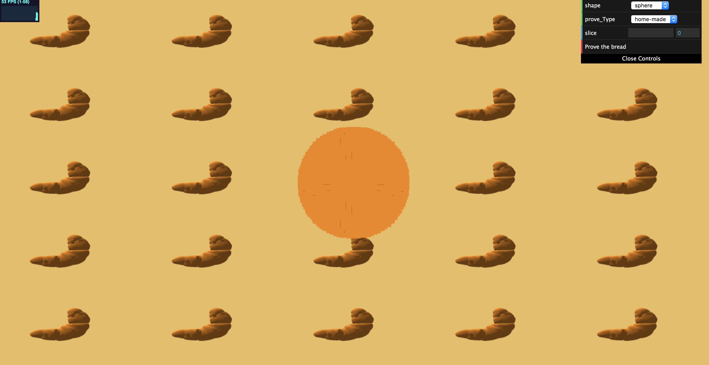
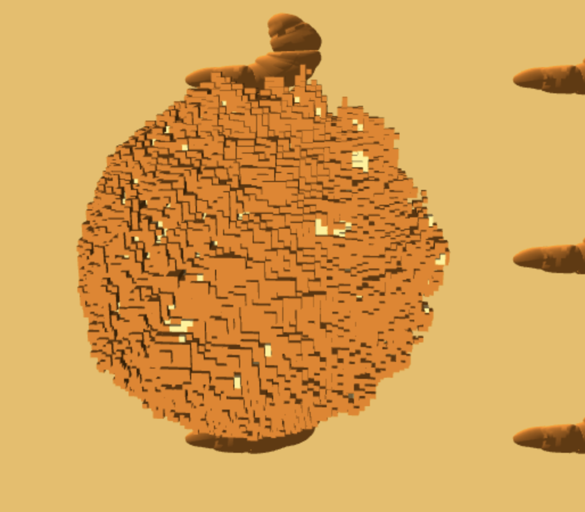
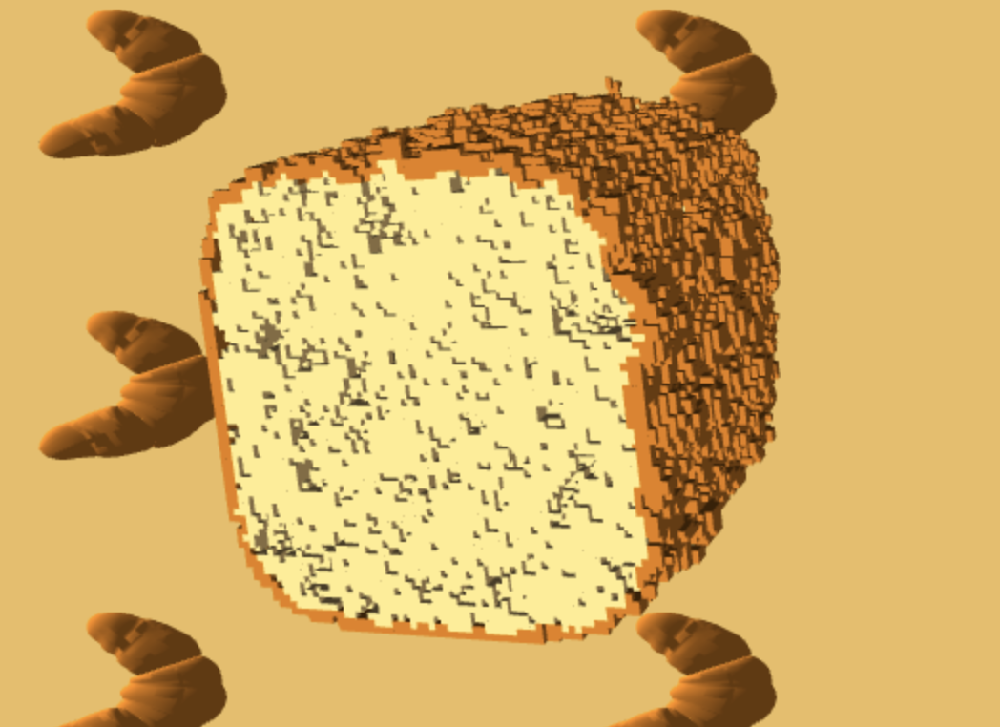
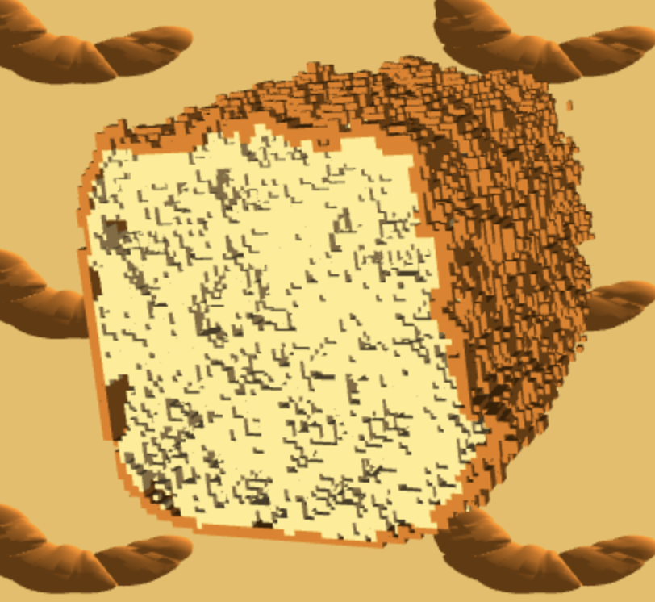
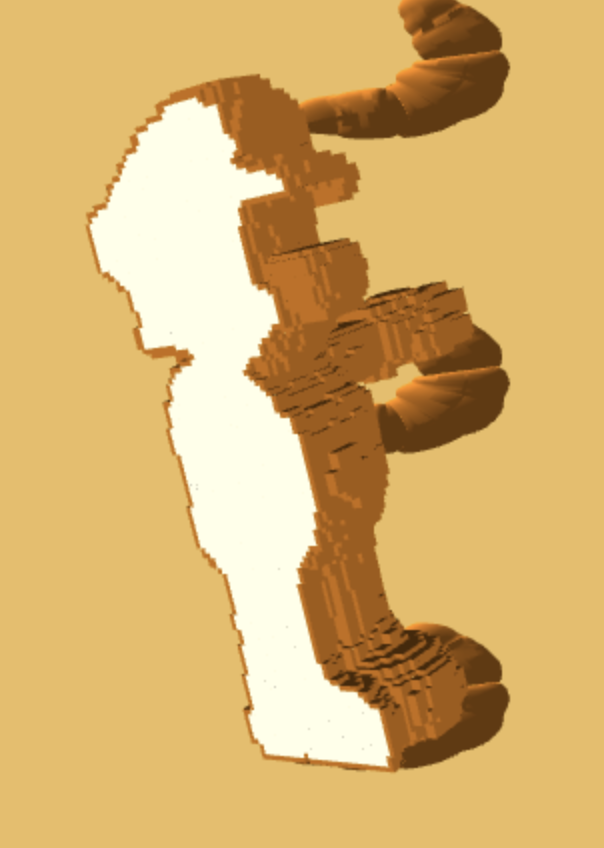
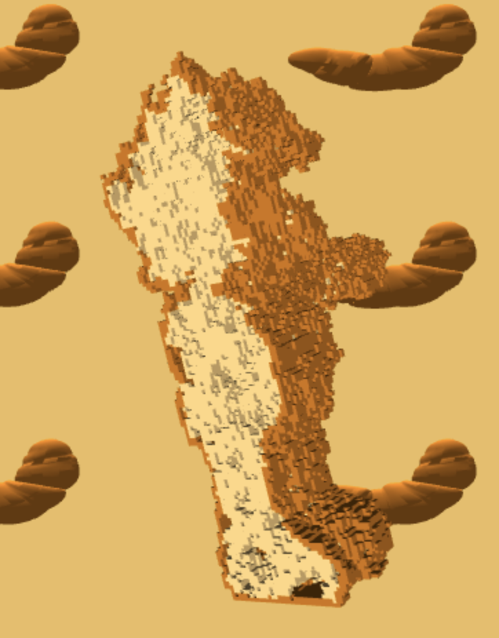

# Homework 4: L-systems

## Program Information
Name: Chianti Yan

Pennkey: 85100574

## Inspiration

The project is based on the paper, *Procedural bread making*, by Rodrigo Baravallea, Gustavo Ariel Patow and ClaudioDelrieux. The paper is linked below: <https://www.sciencedirect.com/science/article/pii/S0097849315000503?via%3Dihub>

## Demo Page
The demo link is here: https://chiantiyzy.github.io/566-final/. When you first open the link, you will see a sphere like this:

This sphere is the starting stage of a bread without proving yet. You can click on the *"Prove the bread"* button on the GUI table. After that (it may take a while), you will see the bread being proved. Bubbles will be generated inside of the bread, and the surface will be deformed due to the bubble generation. 

A proved round bread looks like below:

After the proving process, you can use the *"slice"* scrollbar to make slices and see inside. 

## Algorithm Explained 

+ **Voxelization**

  We take any .obj file and convert it to a binary .txt file. The converter provides the x,y,z coordinates with every voxel on the object. After that, we can parse the .txt file in our code and generate an instance object at these positions. The voxelization convertor is available online. 

  You can also convert the .obj file to .raw file using binvox. Raw files are binary files with every 1 representing the voxel within the geometry and 0 representing the voxels outside of the geometry. 

  

+ **Bubble Generation**

  When the bread is proved, CO2 comes in and makes bubbles inside of the bread. The relationship between the amount N(r) of spheres to be subtracted to the material at each step, and their respective radii *r*, is given by following the fractal law: N(r) = k / (r^d). 

  k is the actual amount of spheres at each radius and d is the fractal exponent that models the likelihood of occurrence of spheres in relation with their radii.

  The author also provides valid k and d values for generating physical-realistic bread. Detailed numbers could be found in the paper, and I modified the numbers to generate my own bread types. 

  + *home-made*

    

  + *baguette*

    

  The difference is a little bit hard to tell here but basically baguette has more round bubbles whereas home-made breads have more spread-out bubbles.

  Ideally, the paper calculated the distance between every voxel to its closest boundry voxel to make sure that the bubbles won't be generated on the surface. Since we used webGL with really high resolution voxels on local server, the calculation is considered way too time-consuming. Therefore, I used some tricky techniques to achieve this. 

  In the voxelization stage, I generated two sets of .txt file. One measures the entire gemoetry and the other only measures the boundary. Therefore, any bubble generated on the boundary area will be abandoned. 

  

+ **Crust Deformation **

  Since the bubbles are generated, the original bread boundaries will be deformed due to the bubble expension. According to the paper, the dough rising is entirely based on the bubble location and radius. The original algorithm required the matrix calculation on the distance matrix, so just as the proving stage, I used some approximation methods to achieve the deformation.

  I first calculate the maxium radius of bubble on each voxel, and summed them up based on x, y, z direction. Therefore, we get the information that how many bubbles are generated on each row and line. I then expend each row and line in the model's 3D array based on #of bubble on the line * 1.1.

  The detailed expension method is inspired by the *Erosion and Dilation Method* for image processing. 

  The effect of the deformation is as below. 

  | Before Proving & Deformation | After Proving & Deformation |
  | ---------------------------- | --------------------------- |
  |             |              |

+ **Background **

  The backgound is a loaded crossiant obj on a flat instance shader. I got the inspiration from Haoran Wei's L-system project. The link is as following: <https://github.com/whaoran0718/hw04-l-systems>

  I also added lights on the scene because shadows make the bubbles more obvious. 