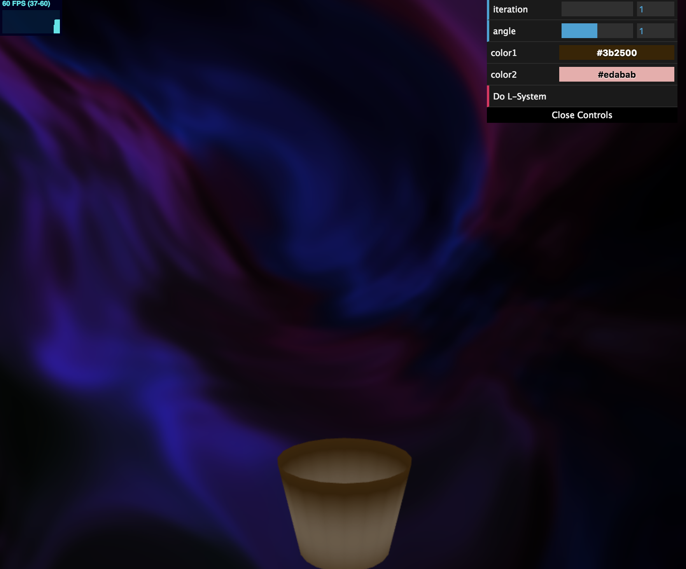

# Homework 4: L-systems

## Programm Information
Name: Chianti Yan

Pennkey: 85100574

## Demo Page
The Demo link is here: https://chiantiyzy.github.io/hw04-l-systems/

When you open the link, you should see a blank website looks like this:

This is the background shader produced using procedural.

To actually see the L-System plant, place use the control menu, play around with colors and sizes (color1 is branch color, color2 is flower color). After you choose the parameters, click "**Do L-System**" and you will see the tree as below:

I think I miss the part of cleaning my vbo so if you want to change some inputs, fresh the website and change the parameters again...

## Project Explaination

__Grammar__: I used the L-system editor to test my L-system, which is really helpful. The link is as below:http://www.kevs3d.co.uk/dev/lsystems/

The Rules are actually really simple: 

| X = FFF [-FX] [+FX] [++FX] [--FX]_*_ | 

|_*_ = F_*_  | 

F: move forward

_-_/_+_: randomly rotate along 3 dimension

*: flower

Since I only want the flower at the top of each branch, I put it in the end of the grammar and also let it extended one more branch such that it won't be hidden inside the branches. Also, I don't want the flowers closer to the ground or on the main branch, so I set the rule that if we didn't hit enough 'F' (aka we didn't grow tall enough), then don't draw the flowers. 

__Geometry__: The primitive .obj files are modeld in Maya. 

To make it looks more like a real tree, I scaled down the branches and flowers as it grows. The basic logic is that: if we hit 'F', scale down the primitive; if we hit '[', store current scaler information; it we hit ']', pop the previous scaler information. In this way, the branch can grow smaller seperately on each division. The output looks like this:

__Background__: The background is a simple procedual noise function credit to IQ: http://iquilezles.org/www/articles/warp/warp.htm

